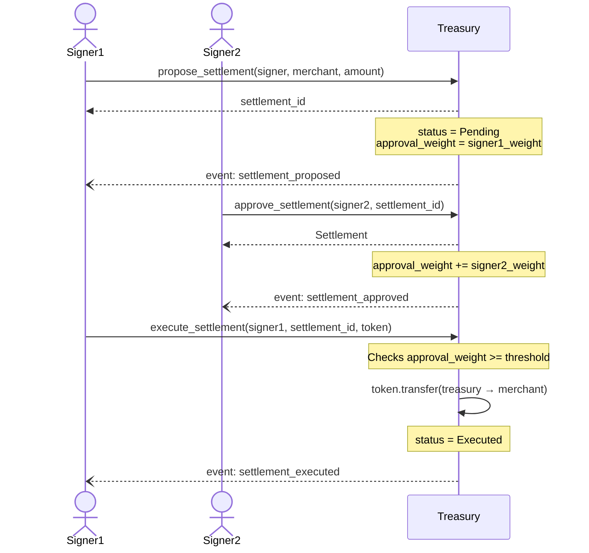
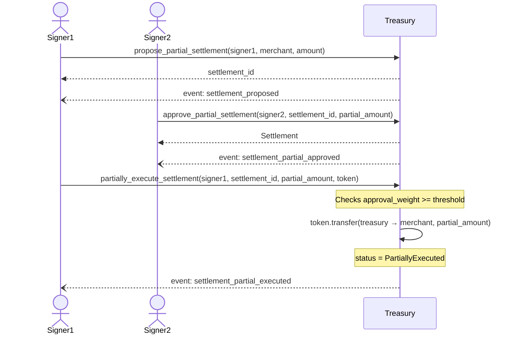
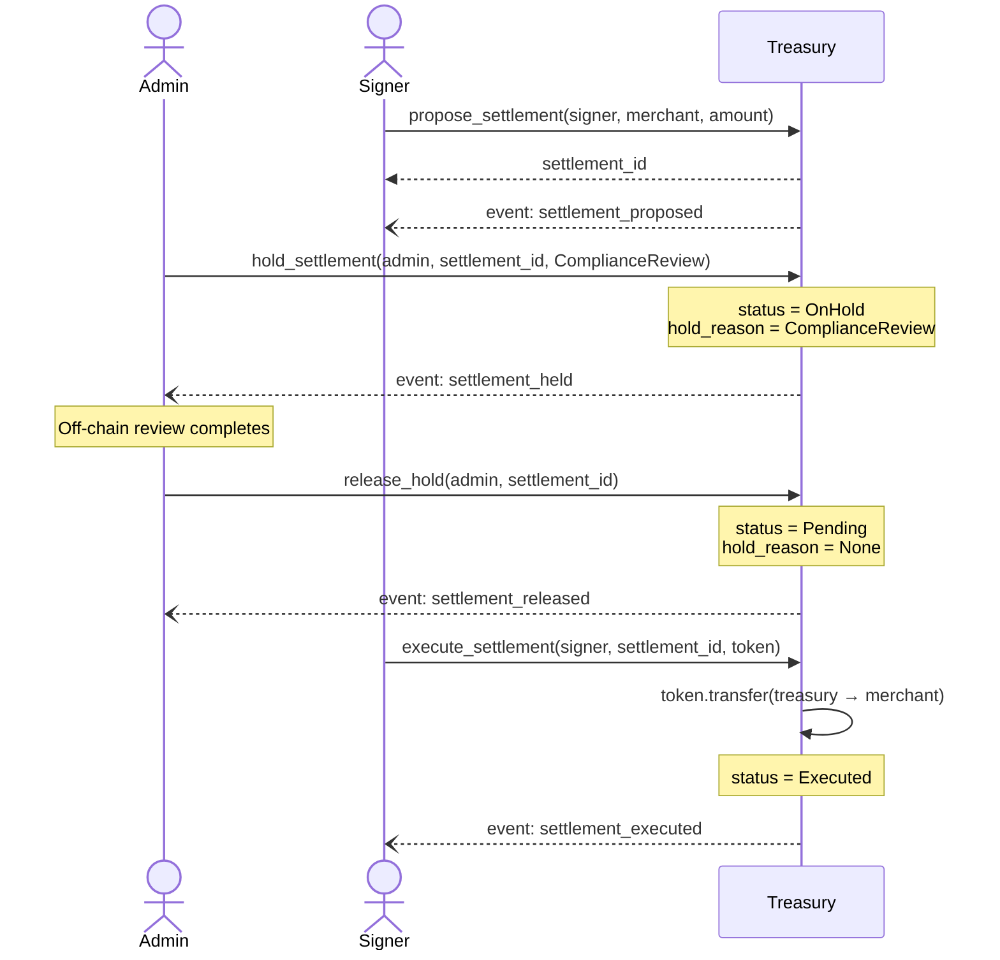
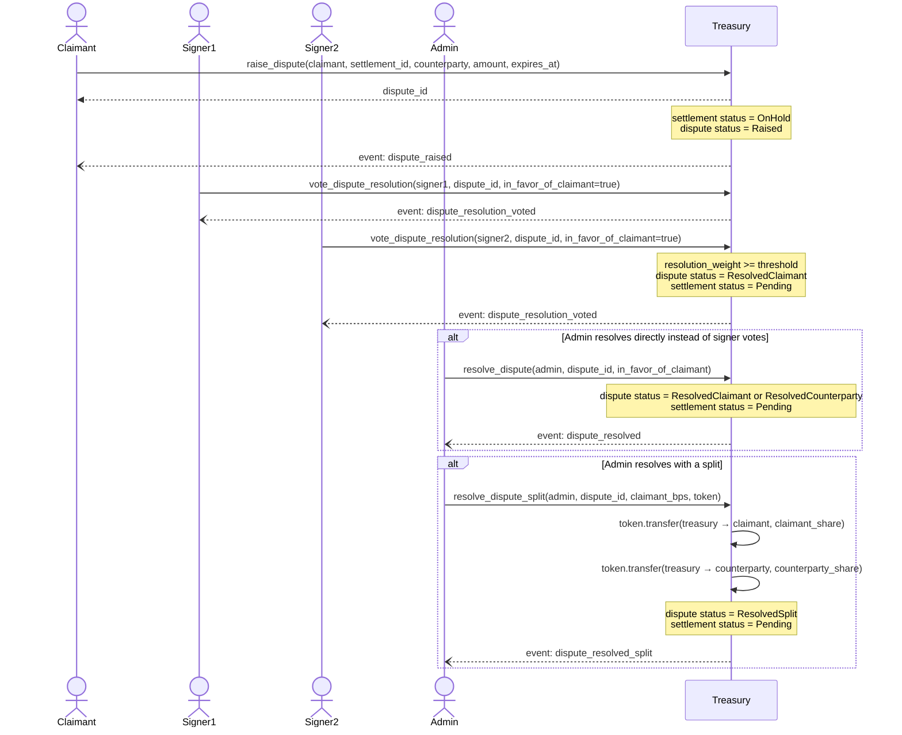
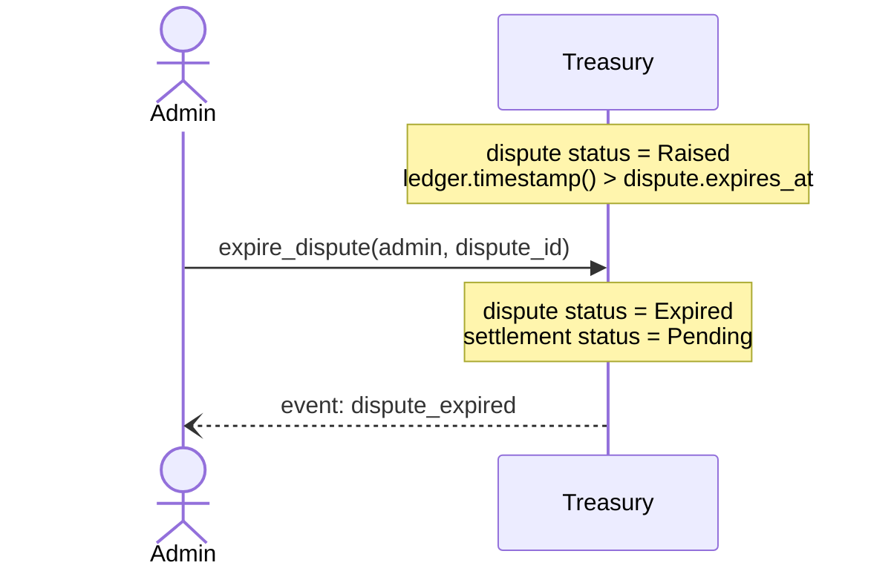

# Treasury Contract

The Treasury contract manages funds and settlements using a multi-signature approval process. It supports settlement proposals, partial settlements, disputes, and signer rotations.

---

## Flow Diagrams

The sequence diagrams below describe the primary flows supported by the treasury. Each diagram uses the actors that call the on-chain entrypoints and shows which events are emitted.

### 1. Proposal and Approval Flow

A signer proposes a settlement; one or more signers approve it; once cumulative weight meets the threshold a signer executes it.



### 2. Partial Execution Flow

A signer proposes a settlement and a partial amount is approved and transferred instead of the full amount.



### 3. Hold Flow

An admin places a settlement on hold (e.g. for compliance review) and later releases it so it can proceed.



### 4. Dispute Flow

A claimant raises a dispute on a pending settlement; signers vote on the resolution; once threshold is met the dispute is resolved and the settlement hold is lifted.



### 5. Dispute Expiry Flow

If a dispute passes its `expires_at` deadline without resolution, an admin can expire it, releasing the settlement back to `Pending`.



---

## Entrypoints

| Function | Auth Required | Parameters | Returns | Errors |
|----------|---------------|------------|---------|--------|
| `initialize` | `admin` | `admin: Address, threshold: u32` | `Result<(), TreasuryError>` | `AlreadyInitialized`, `ZeroThreshold` |
| `set_signer` | `admin` | `admin: Address, signer: Address, weight: u32` | `()` | `Unauthorized` |
| `propose_settlement` | `signer` | `signer: Address, merchant_address: Address, amount: i128` | `u64` | `ContractPaused`, `UnauthorizedSigner`, `InvalidAmount` |
| `propose_partial_settlement` | `signer` | `signer: Address, merchant_address: Address, amount: i128` | `u64` | `ContractPaused`, `UnauthorizedSigner`, `InvalidAmount` |
| `approve_settlement` | `signer` | `signer: Address, settlement_id: u64` | `Settlement` | `ContractPaused`, `UnauthorizedSigner`, `SettlementNotFound`, `AlreadyExecuted` |
| `approve_partial_settlement` | `signer` | `signer: Address, settlement_id: u64, partial_amount: i128` | `Settlement` | `ContractPaused`, `UnauthorizedSigner`, `SettlementNotFound`, `AlreadyExecuted`, `InvalidAmount` |
| `execute_settlement` | `signer` | `signer: Address, settlement_id: u64, token_contract: Address` | `()` | `ContractPaused`, `UnauthorizedSigner`, `SettlementNotFound`, `SettlementOnHold`, `AlreadyExecuted`, `ThresholdNotConfigured`, `ThresholdNotMet`, `InvalidTokenContract`, `TokenNotAllowed` |
| `partially_execute_settlement` | `signer` | `signer: Address, settlement_id: u64, partial_amount: i128, token_contract: Address` | `()` | `ContractPaused`, `UnauthorizedSigner`, `SettlementNotFound`, `AlreadyExecuted`, `ThresholdNotConfigured`, `ThresholdNotMet`, `InvalidTokenContract`, `InvalidAmount` |
| `cancel_settlement` | `signer` | `signer: Address, settlement_id: u64` | `()` | `ContractPaused`, `UnauthorizedSigner`, `SettlementNotFound`, `SettlementNotCancellable` |
| `force_cancel_settlement` | `admin` | `admin: Address, settlement_id: u64` | `()` | `Unauthorized`, `SettlementNotFound`, `ForceCancelNotAllowed` |
| `get_pending_settlements` | None | None | `Vec<Settlement>` | None |
| `get_pending_settlements_page` | None | `start: u64, limit: u64` | `Vec<Settlement>` | None |
| `get_settlement` | None | `settlement_id: u64` | `Settlement` | `SettlementNotFound` |
| `update_threshold` | `admin` | `admin: Address, new_threshold: u32` | `Result<(), TreasuryError>` | `Unauthorized`, `ZeroThreshold` |
| `pause` | `admin` | `admin: Address` | `()` | `Unauthorized` |
| `unpause` | `admin` | `admin: Address` | `()` | `Unauthorized` |
| `raise_dispute` | `claimant` | `claimant: Address, settlement_id: u64, counterparty: Address, amount: i128` | `u64` | `ContractPaused`, `Unauthorized`, `InvalidAmount` |
| `resolve_dispute` | `admin` | `admin: Address, dispute_id: u64, in_favor_of_claimant: bool` | `()` | `Unauthorized`, `ContractPaused`, `DisputeNotFound`, `DisputeAlreadyResolved` |
| `resolve_dispute_split` | `admin` | `admin: Address, dispute_id: u64, claimant_bps: u32, token_contract: Address` | `()` | `Unauthorized`, `ContractPaused`, `DisputeNotFound`, `DisputeAlreadyResolved`, `InvalidSplitRatio` |
| `vote_dispute_resolution` | `signer` | `signer: Address, dispute_id: u64, in_favor_of_claimant: bool` | `()` | `ContractPaused`, `UnauthorizedSigner`, `DisputeNotFound`, `DisputeAlreadyResolved`, `ResolutionDirectionMismatch` |
| `deposit` | `from` | `from: Address, token_contract: Address, amount: i128` | `()` | `ContractPaused`, `Unauthorized`, `InvalidAmount` |
| `withdraw` | `to` | `to: Address, token_contract: Address, amount: i128` | `()` | `ContractPaused`, `Unauthorized`, `InvalidAmount`, `InsufficientBalance`, `DestinationNotAllowed`, `WithdrawalLimitExceeded` |
| `withdraw_all` | `admin` | `admin: Address, token_contract: Address, recipient: Address` | `()` | `Unauthorized`, `NotPaused`, `WithdrawalLimitExceeded` |
| `set_withdrawal_limit` | `admin` | `admin: Address, limit: i128, window_secs: u64` | `()` | `Unauthorized` |
| `get_withdrawal_limit` | None | None | `(i128, u64)` | None |
| `add_allowed_token` | `admin` | `admin: Address, token: Address` | `()` | `Unauthorized` |
| `remove_allowed_token` | `admin` | `admin: Address, token: Address` | `()` | `Unauthorized` |
| `get_balance` | None | `address: Address, token_contract: Address` | `i128` | None |
| `get_allowed_tokens` | None | None | `Vec<Address>` | None |
| `propose_signer_rotation` | `proposer` | `proposer: Address, old_signer: Address, new_signer: Address` | `u64` | `UnauthorizedSigner` |
| `approve_signer_rotation` | `approver` | `approver: Address, rotation_id: u64` | `SignerRotationProposal` | `UnauthorizedSigner`, `RotationNotFound`, `RotationAlreadyExecuted` |
| `update_merchant_payout_address` | `merchant` | `merchant: Address, new_payout_address: Address` | `()` | `ContractPaused`, `Unauthorized` |
| `get_merchant_payout_address` | None | `merchant: Address` | `Option<Address>` | None |
| `hold_settlement` | `admin` | `admin: Address, settlement_id: u64, reason: SettlementHoldReason` | `()` | `Unauthorized`, `SettlementNotFound`, `AlreadyExecuted` |
| `release_hold` | `admin` | `admin: Address, settlement_id: u64` | `()` | `Unauthorized`, `SettlementNotFound`, `NotOnHold` |

## CLI usage examples

Replace `$TREASURY_CONTRACT`, `$ADMIN`, `$SIGNER`, `$MERCHANT`, `$TOKEN`, and `$NETWORK` with your deployed values.

### initialize

```sh
stellar contract invoke \
  --id $TREASURY_CONTRACT \
  --source $ADMIN \
  --network $NETWORK \
  -- initialize \
  --admin $ADMIN \
  --threshold 2
```

### propose_settlement

```sh
stellar contract invoke \
  --id $TREASURY_CONTRACT \
  --source $SIGNER \
  --network $NETWORK \
  -- propose_settlement \
  --signer $SIGNER \
  --merchant_address $MERCHANT \
  --amount 10000000
```

Returns the new settlement ID (`u64`).

### approve_settlement

```sh
stellar contract invoke \
  --id $TREASURY_CONTRACT \
  --source $SIGNER2 \
  --network $NETWORK \
  -- approve_settlement \
  --signer $SIGNER2 \
  --settlement_id 0
```

### execute_settlement

```sh
stellar contract invoke \
  --id $TREASURY_CONTRACT \
  --source $SIGNER \
  --network $NETWORK \
  -- execute_settlement \
  --signer $SIGNER \
  --settlement_id 0 \
  --token_contract $TOKEN
```

---

## Multi-token deposit accounting (#448)

Deposit balances are stored under `DataKey::Balance(holder, token_contract)` in
`crates/multisig/src/lib.rs` — every entry is keyed by *both* the depositor/withdrawer address
and the token contract, so balances for concurrently-allowlisted tokens are segregated and never
mix. `deposit`, `batch_deposit`, `withdraw`, and `get_balance` all read/write this per-(holder,
token) bucket. Note `execute_settlement`/`partially_execute_settlement` don't consult
`DataKey::Balance` at all — they pay merchants directly out of the treasury's on-chain token
balance via `token::Client::transfer`, so the deposit ledger and the settlement flow are
independent accounting paths by design.

---

## Settlement Hold Reasons

`SettlementHoldReason` (defined in `crates/multisig/src/lib.rs`) is attached to a settlement via `hold_settlement` and cleared via `release_hold`. It records why a settlement was paused so operators and auditors can see which off-chain process is responsible for lifting the hold.

| Variant | Used when | Set by (off-chain process) |
|---------|-----------|-----------------------------|
| `None` | Settlement is not on hold (default state). | N/A |
| `ComplianceReview` | A settlement is flagged for manual compliance review before funds can move. | Compliance/AML review workflow |
| `FraudCheck` | Suspicious activity is detected on the settlement or associated merchant. | Fraud detection / risk system |
| `KycPending` | The merchant or counterparty has not completed KYC verification. | KYC/identity verification process |
| `AdminHold` | An operator manually pauses a settlement for a reason not covered above. | Manual admin action |

---

## Emergency force-cancel

`force_cancel_settlement` (see #457) is an emergency-only admin override for a settlement that is permanently stuck in `Pending` or `OnHold` and unreachable through the normal `cancel_settlement`/dispute-resolution paths — for example when the signer weight required to reach quorum has become unavailable. Unlike `cancel_settlement`, it requires only `admin` auth rather than signer quorum, which is exactly why it must be used sparingly and only as a last resort: confirm normal recovery paths are genuinely unavailable before calling it. It force-cancels one specifically identified settlement by ID only — it never touches signer weights, thresholds, or other settlements. Every call emits a distinct `settlement_force_cancelled` event (separate from `settlement_cancelled`) carrying the invoking admin's address for audit purposes. If an admin-action timelock lands in this repo, this entrypoint should be gated behind it.
